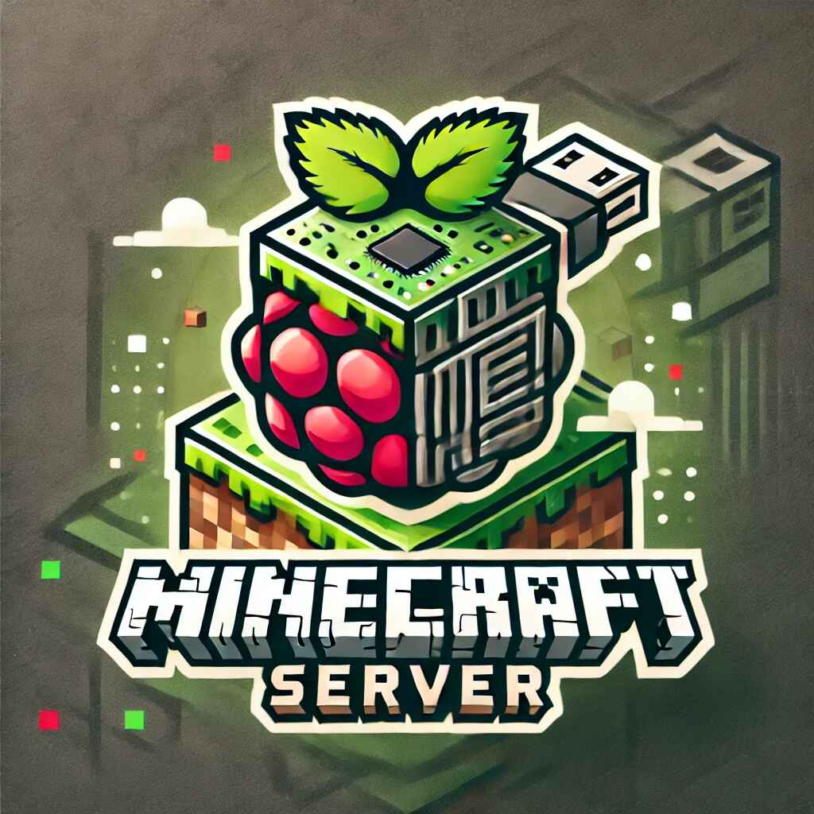

<h1 style="text-align:center">Minecraft Server</h1>

Este repositorio contiene la estructura y los scripts necesarios para instalar y gestionar un servidor de Minecraft no oficial. Se proporciona una configuración básica y fácil de usar para comenzar a jugar con cuentas no oficiales.

    

## Requisitos
- Raspberry Pi: Este servidor está diseñado para funcionar en una Raspberry Pi con Ubuntu Server.
- Conexión a Internet: Necesaria para descargar los archivos necesarios.

## Instalación

1. Clonar el repositorio:
      git clone https://github.com/otema666/minecraft-server.git
   cd minecraft-server
   

2. Ejecutar el script de instalación:
      chmod +x install.sh
   ./install.sh
   

3. Iniciar el servidor:
      ./start.sh
   
### Instalación del cliente:
[Click aquí para ver la guía de instalación en el cliente](client.md)

## Configuración
- La configuración principal del servidor se encuentra en el archivo [server.properties](server.properties)
- Los archivos de configuración se encuentran en la carpeta [config/](config/). Puedes editar los archivos .yml según tus preferencias.

### Ejemplos de configuración:

- server.yml: Configuraciones del servidor.
- permissions.yml: Configuraciones de permisos para usuarios.

## Plugins
Para la guía de instalación de plugins, consultar estas páginas:

* [docs.papermc.io](https://docs.papermc.io/paper/next-steps)
* [raspberrytips.es](https://raspberrytips.es/minecraft-servidor-raspberry-pi/)

## Uso de cuentas no oficiales

Para jugar con cuentas no oficiales, asegúrate de tener un cliente de Minecraft modificado que permita la autenticación con cuentas no oficiales.

## Contribuciones

¡Las contribuciones son bienvenidas! Si deseas agregar mejoras o arreglar problemas, por favor crea un fork del repositorio y envía un pull request.

## Licencia

Este proyecto está bajo la Licencia MIT. Consulta el archivo LICENSE para más información.

## Contacto

Si tienes preguntas o sugerencias, no dudes en abrir un issue en el repositorio o contactarme directamente.