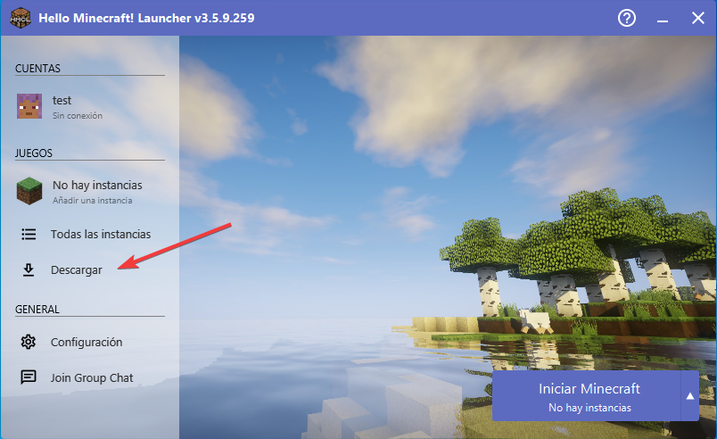
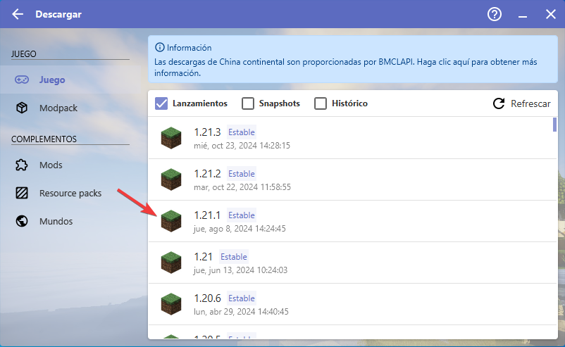
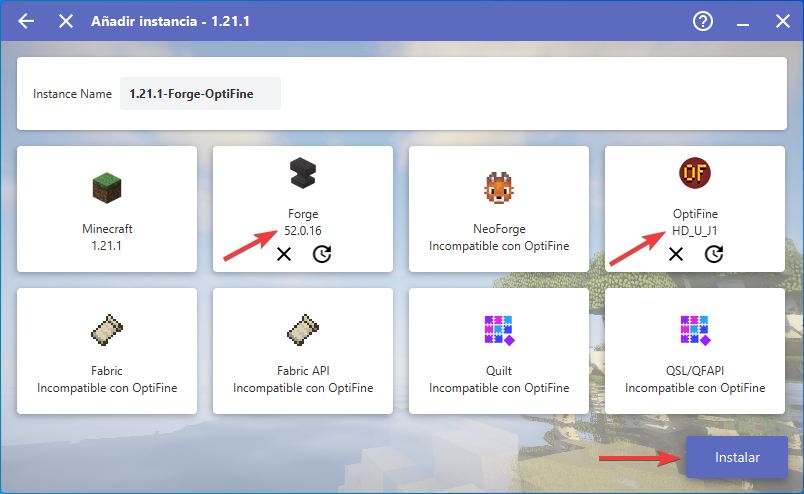
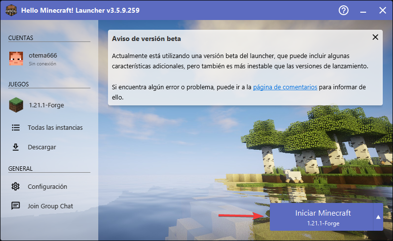
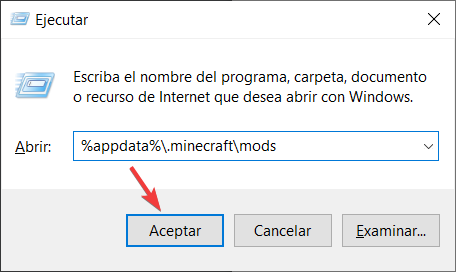

<h1 style="text-align:center">Guía de instalación de Minecraft</h1>

1. Descargar el [instalador de Java](assets/jre-8u431-windows-x64.exe). 
2. Descargar el [HMCL](assets/HMCL-3.5.9.259.exe). 
3. Instalar la versión 1.21.1

## Instalación del HMCL
1. Abrimos el HMCL y le damos a Descargar

2. Hacemos click en la version 1.21.1

3. Seleccionamos los siguientes puntos:
- Forge 52.0.16
- OptiFine HD_U_J1
- 

4. Ahora ya podemos iniciar el minecraft

## Instalación de mods
1. Pulsar `Win + R` y ejecutar `%appdata%\.minecraft\mods`.

2. Añadimos los siguientes mods:
- [Clumps](assets/Clumps-forge-1.21.1-19.0.0.1.jar) Recomendado (cambia el aspecto de los orbes de experiencia y reduce el lag en el server al recoger experiencia)
- [Journeymap](assets/journeymap-forge-1.21.1-6.0.0-beta.28.jar) Mapa avanzado en tiempo real y puntos de ruta.

- [Sound Physics](assets/sound-physics-remastered-forge-1.21.1-1.4.8.jar) Proporciona atenuación de sonido, reverberación y absorción realistas a través de bloques.

- [Inventory HUD](assets/inventoryhud.forge.1.21.1-3.4.26.jar) Muestra tu inventario mientras juegas, puedes cambiar entre mods (mini/normal y horizontal/vertical), también puedes cambiar la transparencia del fondo y activar/desactivar la animación